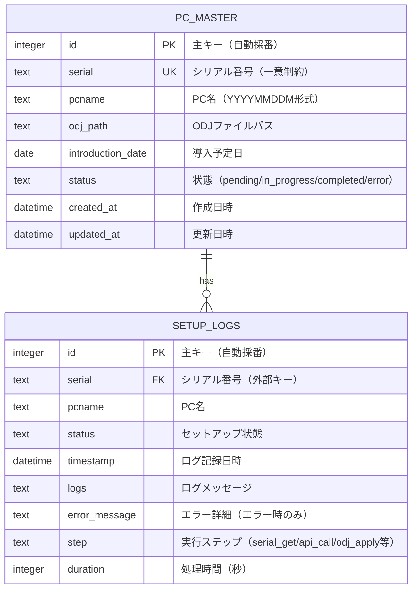
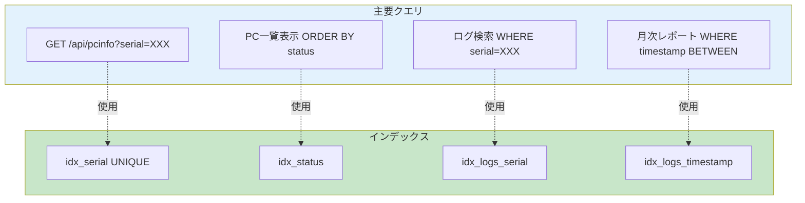
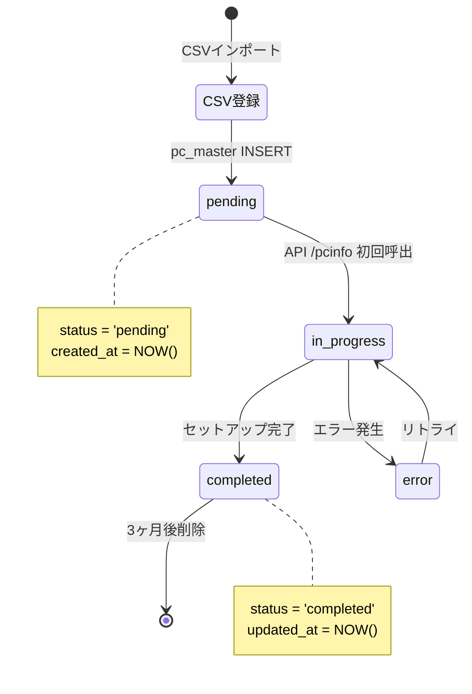
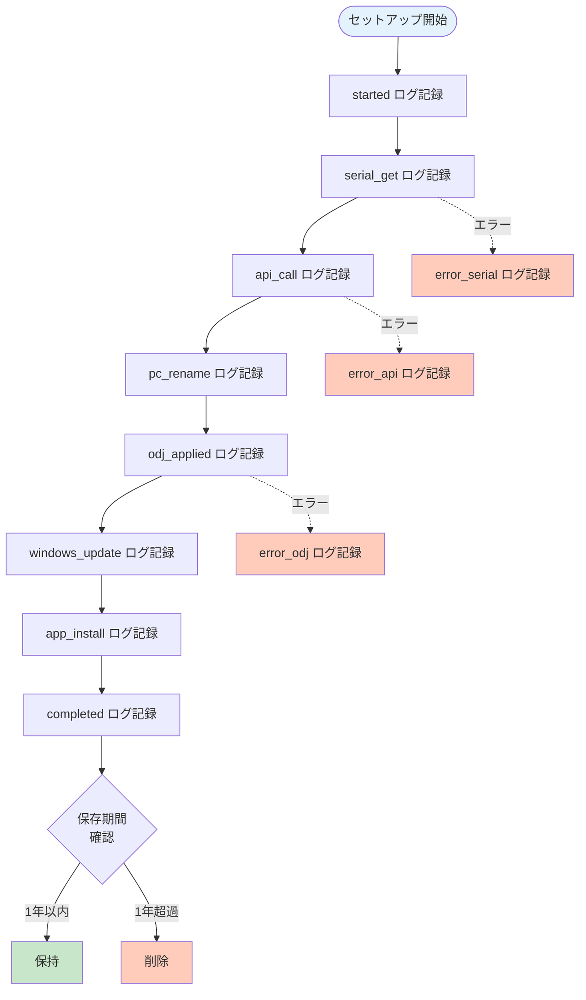
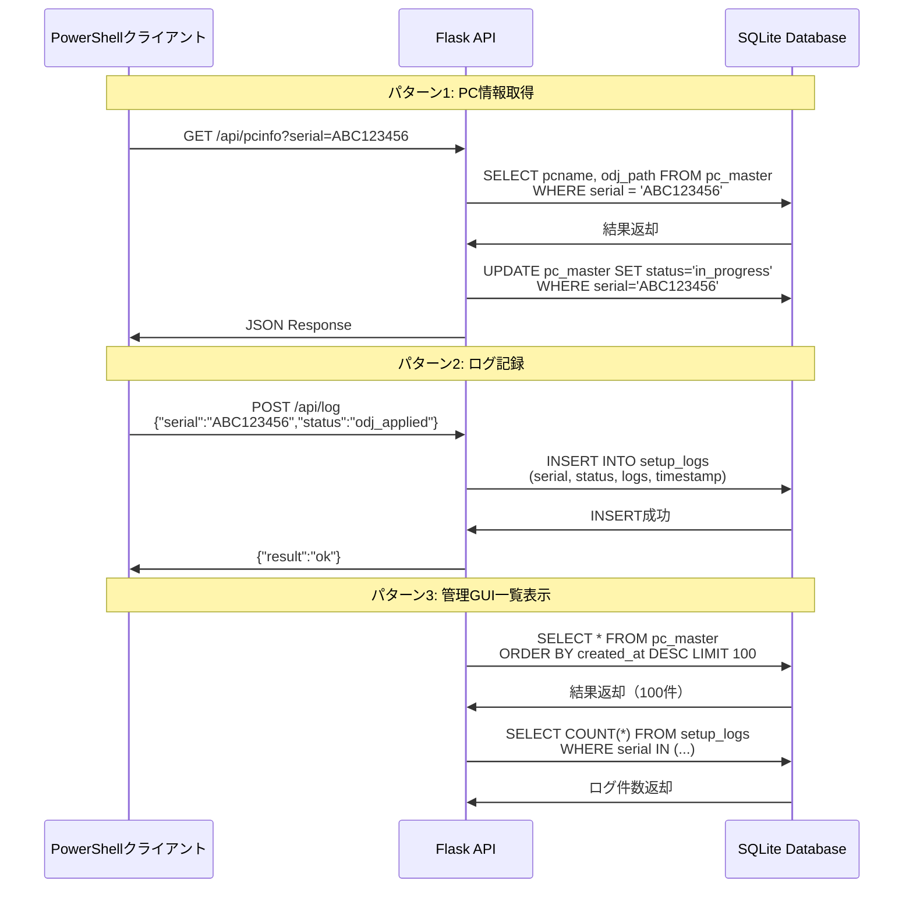

# ER図（Entity-Relationship Diagram）

## 概要

会社キッティング自動化フレームワークのデータベーススキーマとエンティティ間の関係を示します。

## 目次

1. [データベースER図](#データベースer図)
2. [テーブル詳細定義](#テーブル詳細定義)
3. [インデックス構造図](#インデックス構造図)
4. [データライフサイクル図](#データライフサイクル図)
5. [クエリパターン図](#クエリパターン図)

---

## データベースER図

### 論理ER図（Mermaid）



### 物理ER図（ASCII art）

```
┌─────────────────────────────────────────────────────────────────┐
│                         PC_MASTER                                │
├─────────────────────────────────────────────────────────────────┤
│ PK  id                INTEGER AUTOINCREMENT                      │
│ UK  serial            TEXT NOT NULL                              │
│     pcname            TEXT NOT NULL                              │
│     odj_path          TEXT                                       │
│     introduction_date DATE                                       │
│     status            TEXT DEFAULT 'pending'                     │
│     created_at        DATETIME DEFAULT CURRENT_TIMESTAMP         │
│     updated_at        DATETIME DEFAULT CURRENT_TIMESTAMP         │
├─────────────────────────────────────────────────────────────────┤
│ INDEXES:                                                         │
│   - idx_serial (serial)         UNIQUE                           │
│   - idx_pcname (pcname)                                          │
│   - idx_status (status)                                          │
│   - idx_introduction_date (introduction_date)                    │
└─────────────────────────────────────────────────────────────────┘
                                │
                                │ 1:N
                                │
                                ▼
┌─────────────────────────────────────────────────────────────────┐
│                        SETUP_LOGS                                │
├─────────────────────────────────────────────────────────────────┤
│ PK  id                INTEGER AUTOINCREMENT                      │
│ FK  serial            TEXT NOT NULL                              │
│     pcname            TEXT                                       │
│     status            TEXT NOT NULL                              │
│     timestamp         DATETIME DEFAULT CURRENT_TIMESTAMP         │
│     logs              TEXT                                       │
│     error_message     TEXT                                       │
│     step              TEXT                                       │
│     duration          INTEGER                                    │
├─────────────────────────────────────────────────────────────────┤
│ INDEXES:                                                         │
│   - idx_logs_serial (serial)                                     │
│   - idx_logs_status (status)                                     │
│   - idx_logs_timestamp (timestamp)                               │
│   - idx_logs_step (step)                                         │
├─────────────────────────────────────────────────────────────────┤
│ FOREIGN KEY:                                                     │
│   - serial REFERENCES pc_master(serial)                          │
│     ON DELETE CASCADE ON UPDATE CASCADE                          │
└─────────────────────────────────────────────────────────────────┘
```

---

## テーブル詳細定義

### 1. pc_master テーブル

**目的**: PC基本情報とセットアップ状態を管理

**DDL（SQLite）**:
```sql
CREATE TABLE pc_master (
    id                INTEGER PRIMARY KEY AUTOINCREMENT,
    serial            TEXT UNIQUE NOT NULL,
    pcname            TEXT NOT NULL,
    odj_path          TEXT,
    introduction_date DATE,
    status            TEXT DEFAULT 'pending'
                      CHECK(status IN ('pending', 'in_progress', 'completed', 'error')),
    created_at        DATETIME DEFAULT CURRENT_TIMESTAMP,
    updated_at        DATETIME DEFAULT CURRENT_TIMESTAMP
);

-- インデックス作成
CREATE UNIQUE INDEX idx_serial ON pc_master(serial);
CREATE INDEX idx_pcname ON pc_master(pcname);
CREATE INDEX idx_status ON pc_master(status);
CREATE INDEX idx_introduction_date ON pc_master(introduction_date);

-- 更新日時自動更新トリガー
CREATE TRIGGER update_pc_master_timestamp
AFTER UPDATE ON pc_master
FOR EACH ROW
BEGIN
    UPDATE pc_master SET updated_at = CURRENT_TIMESTAMP WHERE id = NEW.id;
END;
```

**カラム詳細**:

| カラム名 | データ型 | 制約 | 説明 | 例 |
|---------|---------|------|------|-----|
| id | INTEGER | PK, AUTOINCREMENT | 主キー | 1 |
| serial | TEXT | UNIQUE, NOT NULL | PCシリアル番号 | ABC123456 |
| pcname | TEXT | NOT NULL | PC名（YYYYMMDDM） | 20251116M |
| odj_path | TEXT | NULL許可 | ODJファイルパス | /srv/odj/20251116M.txt |
| introduction_date | DATE | NULL許可 | 導入予定日 | 2025-11-16 |
| status | TEXT | CHECK制約, DEFAULT | セットアップ状態 | pending |
| created_at | DATETIME | DEFAULT CURRENT_TIMESTAMP | 作成日時 | 2025-11-16 10:00:00 |
| updated_at | DATETIME | DEFAULT CURRENT_TIMESTAMP | 更新日時 | 2025-11-16 12:30:00 |

**status値の定義**:

| 値 | 意味 | 遷移条件 |
|----|------|---------|
| pending | 未展開（CSV登録直後） | 初期状態 |
| in_progress | セットアップ中 | API /pcinfo 初回呼出時 |
| completed | セットアップ完了 | API /log status=completed受信時 |
| error | エラー発生 | API /log status=error受信時 |

**サンプルデータ**:
```sql
INSERT INTO pc_master (serial, pcname, odj_path, introduction_date, status)
VALUES
  ('ABC123456', '20251116M', '/srv/odj/20251116M.txt', '2025-11-16', 'completed'),
  ('DEF789012', '20251116M', '/srv/odj/20251116M-2.txt', '2025-11-16', 'in_progress'),
  ('GHI345678', '20251117M', '/srv/odj/20251117M.txt', '2025-11-17', 'pending');
```

---

### 2. setup_logs テーブル

**目的**: セットアップ実行ログを時系列で記録

**DDL（SQLite）**:
```sql
CREATE TABLE setup_logs (
    id            INTEGER PRIMARY KEY AUTOINCREMENT,
    serial        TEXT NOT NULL,
    pcname        TEXT,
    status        TEXT NOT NULL
                  CHECK(status IN ('started', 'serial_get', 'api_call', 'pc_rename',
                                   'odj_applied', 'windows_update', 'app_install',
                                   'completed', 'error_serial', 'error_api',
                                   'error_odj', 'error_update', 'error_app')),
    timestamp     DATETIME DEFAULT CURRENT_TIMESTAMP,
    logs          TEXT,
    error_message TEXT,
    step          TEXT,
    duration      INTEGER,
    FOREIGN KEY (serial) REFERENCES pc_master(serial)
        ON DELETE CASCADE
        ON UPDATE CASCADE
);

-- インデックス作成
CREATE INDEX idx_logs_serial ON setup_logs(serial);
CREATE INDEX idx_logs_status ON setup_logs(status);
CREATE INDEX idx_logs_timestamp ON setup_logs(timestamp);
CREATE INDEX idx_logs_step ON setup_logs(step);
```

**カラム詳細**:

| カラム名 | データ型 | 制約 | 説明 | 例 |
|---------|---------|------|------|-----|
| id | INTEGER | PK, AUTOINCREMENT | 主キー | 1 |
| serial | TEXT | FK, NOT NULL | PCシリアル番号 | ABC123456 |
| pcname | TEXT | NULL許可 | PC名 | 20251116M |
| status | TEXT | CHECK制約, NOT NULL | ログステータス | odj_applied |
| timestamp | DATETIME | DEFAULT CURRENT_TIMESTAMP | ログ記録日時 | 2025-11-16 11:00:00 |
| logs | TEXT | NULL許可 | ログメッセージ | "ODJ適用成功" |
| error_message | TEXT | NULL許可 | エラー詳細 | "djoin exit code: 5" |
| step | TEXT | NULL許可 | 実行ステップ名 | "Apply-ODJ" |
| duration | INTEGER | NULL許可 | 処理時間（秒） | 120 |

**status値の定義**:

| 値 | 意味 | エラーフラグ |
|----|------|------------|
| started | セットアップ開始 | 通常 |
| serial_get | Serial番号取得完了 | 通常 |
| api_call | API呼出成功 | 通常 |
| pc_rename | PC名設定完了 | 通常 |
| odj_applied | ODJ適用完了 | 通常 |
| windows_update | Windows Update完了 | 通常 |
| app_install | アプリ導入完了 | 通常 |
| completed | 全工程完了 | 通常 |
| error_serial | Serial取得失敗 | エラー |
| error_api | API呼出失敗 | エラー |
| error_odj | ODJ適用失敗 | エラー |
| error_update | Windows Update失敗 | エラー |
| error_app | アプリ導入失敗 | エラー |

**サンプルデータ**:
```sql
INSERT INTO setup_logs (serial, pcname, status, logs, step, duration)
VALUES
  ('ABC123456', '20251116M', 'started', 'セットアップ開始', 'Main', NULL),
  ('ABC123456', '20251116M', 'serial_get', 'Serial: ABC123456', 'Get-SerialNumber', 2),
  ('ABC123456', '20251116M', 'api_call', 'PC名取得: 20251116M', 'Get-PCInfoFromAPI', 5),
  ('ABC123456', '20251116M', 'pc_rename', 'PC名設定完了', 'Set-PCName', 10),
  ('ABC123456', '20251116M', 'odj_applied', 'ODJ適用成功', 'Apply-ODJ', 120),
  ('ABC123456', '20251116M', 'windows_update', 'Windows Update完了', 'Run-WindowsUpdate', 1800),
  ('ABC123456', '20251116M', 'app_install', 'アプリ導入完了', 'Install-Apps', 600),
  ('ABC123456', '20251116M', 'completed', '全工程完了', 'Main', 2537);
```

---

## インデックス構造図

### インデックス効果分析



### インデックス詳細

#### 1. pc_master テーブルインデックス

```sql
-- 1. Serial検索用（UNIQUE制約により自動作成）
CREATE UNIQUE INDEX idx_serial ON pc_master(serial);
-- 使用クエリ: SELECT * FROM pc_master WHERE serial = ?
-- 効果: O(1) ハッシュ検索

-- 2. 状態別一覧取得用
CREATE INDEX idx_status ON pc_master(status);
-- 使用クエリ: SELECT * FROM pc_master WHERE status = 'pending'
-- 効果: O(log N) B-Tree検索

-- 3. PC名検索用
CREATE INDEX idx_pcname ON pc_master(pcname);
-- 使用クエリ: SELECT * FROM pc_master WHERE pcname = ?
-- 効果: O(log N) B-Tree検索

-- 4. 導入日範囲検索用
CREATE INDEX idx_introduction_date ON pc_master(introduction_date);
-- 使用クエリ: SELECT * FROM pc_master WHERE introduction_date BETWEEN ? AND ?
-- 効果: O(log N) 範囲検索
```

#### 2. setup_logs テーブルインデックス

```sql
-- 1. Serial別ログ検索用
CREATE INDEX idx_logs_serial ON setup_logs(serial);
-- 使用クエリ: SELECT * FROM setup_logs WHERE serial = ?
-- 効果: O(log N) B-Tree検索

-- 2. ステータス別集計用
CREATE INDEX idx_logs_status ON setup_logs(status);
-- 使用クエリ: SELECT COUNT(*) FROM setup_logs WHERE status LIKE 'error_%'
-- 効果: O(log N) 前方一致検索

-- 3. 時系列検索用
CREATE INDEX idx_logs_timestamp ON setup_logs(timestamp);
-- 使用クエリ: SELECT * FROM setup_logs WHERE timestamp >= ?
-- 効果: O(log N) 範囲検索

-- 4. 実行ステップ別分析用
CREATE INDEX idx_logs_step ON setup_logs(step);
-- 使用クエリ: SELECT AVG(duration) FROM setup_logs WHERE step = 'Apply-ODJ'
-- 効果: O(log N) 集計クエリ最適化
```

### 複合インデックス検討

**導入予定日 + 状態の複合検索用**:
```sql
CREATE INDEX idx_date_status ON pc_master(introduction_date, status);
-- 使用クエリ: SELECT * FROM pc_master
--             WHERE introduction_date = '2025-11-16' AND status = 'pending'
-- 効果: 単一インデックスで絞り込み
```

---

## データライフサイクル図

### PC情報のライフサイクル



### ログデータのライフサイクル



### データ削除ポリシー

```sql
-- 3ヶ月以上前の完了PCを削除
DELETE FROM pc_master
WHERE status = 'completed'
  AND updated_at < datetime('now', '-3 months');

-- 1年以上前のログを削除
DELETE FROM setup_logs
WHERE timestamp < datetime('now', '-1 year');

-- 孤立ログ（pc_masterに存在しないSerial）を削除
DELETE FROM setup_logs
WHERE serial NOT IN (SELECT serial FROM pc_master);
```

---

## クエリパターン図

### 主要クエリフロー



### 典型的なクエリ例

#### 1. PC情報取得（API /pcinfo）

```sql
-- Serial番号からPC名とODJパスを取得
SELECT pcname, odj_path
FROM pc_master
WHERE serial = :serial
LIMIT 1;

-- 同時に状態をin_progressに更新
UPDATE pc_master
SET status = 'in_progress',
    updated_at = CURRENT_TIMESTAMP
WHERE serial = :serial
  AND status = 'pending';
```

**実行計画**:
```
QUERY PLAN
|--SEARCH TABLE pc_master USING INDEX idx_serial (serial=?)
|--UPDATE TABLE pc_master USING INDEX idx_serial (serial=?)
```

#### 2. ログ記録（API /log）

```sql
-- セットアップログ挿入
INSERT INTO setup_logs (serial, pcname, status, logs, step, duration)
VALUES (:serial, :pcname, :status, :logs, :step, :duration);

-- 完了時、pc_master状態更新
UPDATE pc_master
SET status = 'completed',
    updated_at = CURRENT_TIMESTAMP
WHERE serial = :serial
  AND status = 'in_progress';
```

#### 3. 管理GUI: PC一覧表示

```sql
-- ページネーション付き一覧取得
SELECT
    pm.id,
    pm.serial,
    pm.pcname,
    pm.introduction_date,
    pm.status,
    pm.created_at,
    pm.updated_at,
    (SELECT COUNT(*) FROM setup_logs sl WHERE sl.serial = pm.serial) AS log_count,
    (SELECT logs FROM setup_logs sl
     WHERE sl.serial = pm.serial
     ORDER BY timestamp DESC LIMIT 1) AS latest_log
FROM pc_master pm
ORDER BY pm.created_at DESC
LIMIT :limit OFFSET :offset;
```

#### 4. 月次レポート: 失敗率算出

```sql
-- 月次セットアップ失敗率
SELECT
    DATE(timestamp, 'start of month') AS month,
    COUNT(*) AS total_setups,
    SUM(CASE WHEN status LIKE 'error_%' THEN 1 ELSE 0 END) AS error_count,
    ROUND(
        CAST(SUM(CASE WHEN status LIKE 'error_%' THEN 1 ELSE 0 END) AS REAL) / COUNT(*) * 100,
        2
    ) AS error_rate_percent
FROM setup_logs
WHERE timestamp >= datetime('now', '-6 months')
GROUP BY DATE(timestamp, 'start of month')
ORDER BY month DESC;
```

#### 5. パフォーマンス分析: ステップ別平均処理時間

```sql
-- 各ステップの平均処理時間
SELECT
    step,
    COUNT(*) AS execution_count,
    AVG(duration) AS avg_duration_sec,
    MIN(duration) AS min_duration_sec,
    MAX(duration) AS max_duration_sec,
    SUM(duration) AS total_duration_sec
FROM setup_logs
WHERE duration IS NOT NULL
  AND timestamp >= datetime('now', '-1 month')
GROUP BY step
ORDER BY avg_duration_sec DESC;
```

**結果例**:
```
step                | execution_count | avg_duration_sec | min_duration_sec | max_duration_sec
--------------------|-----------------|------------------|------------------|------------------
Run-WindowsUpdate   | 100             | 1800.5           | 900              | 3600
Apply-ODJ           | 100             | 120.3            | 90               | 180
Install-Apps        | 100             | 600.2            | 450              | 900
```

---

## データベース最適化

### VACUUM とANALYZE

```sql
-- データベース最適化（月次実行推奨）
VACUUM;

-- 統計情報更新（週次実行推奨）
ANALYZE;
```

### パーティショニング戦略（PostgreSQL移行時）

```sql
-- PostgreSQL: 月別パーティショニング
CREATE TABLE setup_logs_2025_11 PARTITION OF setup_logs
FOR VALUES FROM ('2025-11-01') TO ('2025-12-01');

CREATE TABLE setup_logs_2025_12 PARTITION OF setup_logs
FOR VALUES FROM ('2025-12-01') TO ('2026-01-01');
```

---

## 関連ドキュメント

- [システム構成図.md](./システム構成図.md) - データフロー全体像
- [コンポーネント図.md](./コンポーネント図.md) - Flask APIコンポーネント詳細
- [シーケンス図集.md](./シーケンス図集.md) - API呼び出しシーケンス

---

**作成日**: 2025-11-17
**バージョン**: 1.0
**作成者**: System Architecture Designer
