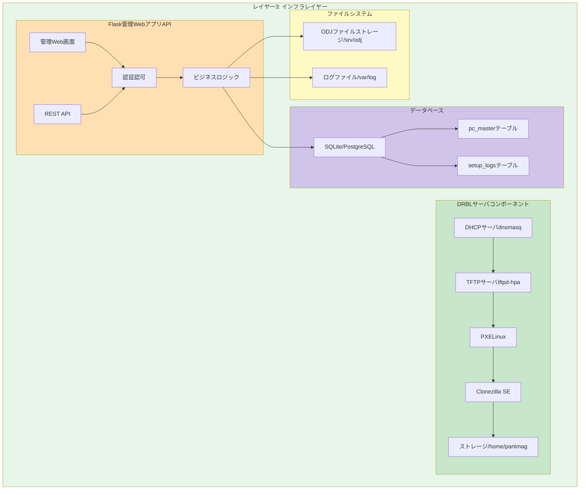
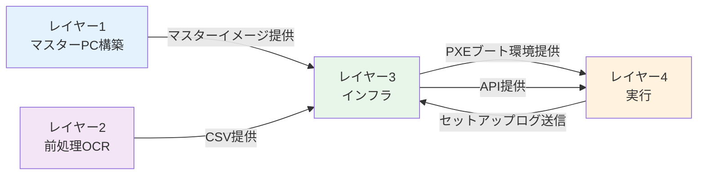
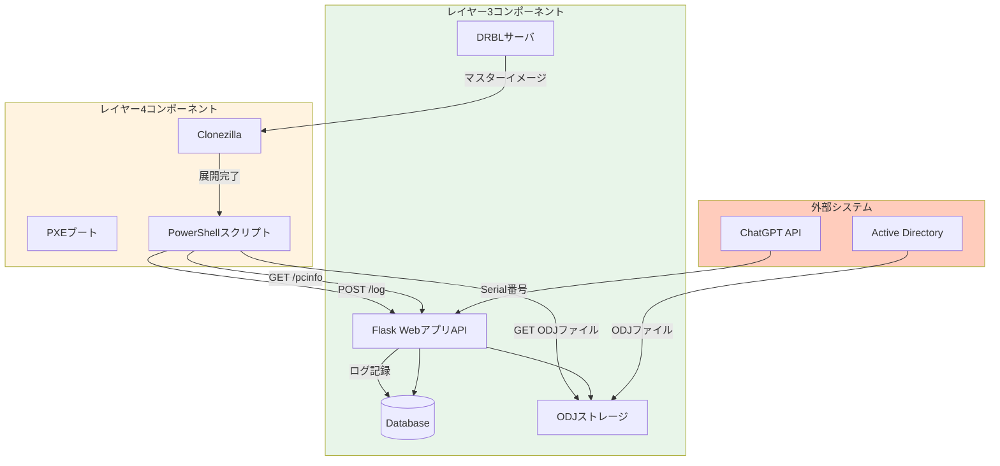
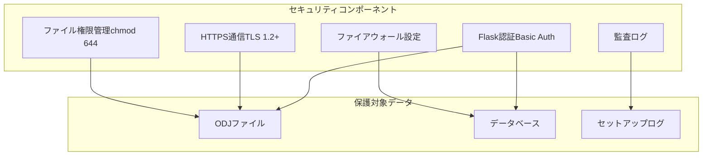

```mermaid
graph TB
    subgraph Layer1[レイヤー1: マスターPC構築レイヤー]
        subgraph OS[OSコンポーネント]
            Win11[Windows 11 Pro/Enterprise]
            Drivers[デバイスドライバ]
            Updates[Windows累積更新プログラム]
        end

        subgraph Apps[アプリケーションコンポーネント]
            M365[Microsoft 365 Apps]
            Security[セキュリティソフト]
            Browser[Edge/Chrome等ブラウザ]
            Others[その他会社標準アプリ]
        end

        subgraph Config[設定コンポーネント]
            GPO[ローカルグループポリシー]
            Registry[レジストリ設定]
            Firewall[Windowsファイアウォール]
            UAC[UAC設定]
        end

        subgraph Sysprep[Sysprep準備コンポーネント]
            AppXRemove[AppX除外スクリプト]
            Unattend[unattend.xml]
            CleanUp[クリーンアップスクリプト]
        end

        subgraph Image[イメージ化コンポーネント]
            SysprepExec[Sysprep実行]
            CloneCapture[Clonezillaキャプチャ]
            ImageFile[マスターイメージファイル]
        end

        Win11 --> Drivers
        Drivers --> Updates
        Updates --> M365
        M365 --> Security
        Security --> Browser
        Browser --> Others
        Others --> GPO
        GPO --> Registry
        Registry --> Firewall
        Firewall --> UAC
        UAC --> AppXRemove
        AppXRemove --> Unattend
        Unattend --> CleanUp
        CleanUp --> SysprepExec
        SysprepExec --> CloneCapture
        CloneCapture --> ImageFile
    end

    style Layer1 fill:#e3f2fd
    style OS fill:#fff9c4
    style Apps fill:#c8e6c9
    style Config fill:#ffe0b2
    style Sysprep fill:#f8bbd0
    style Image fill:#d1c4e9
```

```mermaid
graph TB
    subgraph Layer2[レイヤー2: 前処理箱OCRレイヤー]
        subgraph Input[入力コンポーネント]
            Box[PC箱側面Serial番号]
            Camera[スマホカメラ]
        end

        subgraph OCR[OCRコンポーネント]
            ChatGPT[ChatGPT Vision API]
            Prompt[OCRプロンプト]
            Extract[Serial抽出ロジック]
        end

        subgraph Process[処理コンポーネント]
            Validate[Serial検証]
            GenPCName[PC名生成YYYYMMDDM]
            CSVGen[CSV生成]
        end

        subgraph Output[出力コンポーネント]
            CSVFile[CSVファイル]
            Upload[管理GUIアップロード]
        end

        Box --> Camera
        Camera --> ChatGPT
        ChatGPT --> Prompt
        Prompt --> Extract
        Extract --> Validate
        Validate --> GenPCName
        GenPCName --> CSVGen
        CSVGen --> CSVFile
        CSVFile --> Upload
    end

    style Layer2 fill:#f3e5f5
    style Input fill:#fff9c4
    style OCR fill:#c8e6c9
    style Process fill:#ffe0b2
    style Output fill:#d1c4e9
```

```mermaid
graph TB
    subgraph Layer4[レイヤー4: 実行PXE自動化レイヤー]
        subgraph Boot[ブートコンポーネント]
            BIOS[BIOS/UEFI]
            PXEClient[PXEクライアント]
            Network[ネットワークブート]
        end

        subgraph Deploy[展開コンポーネント]
            CloneDeploy[Clonezilla展開エンジン]
            Partclone[partclone.ntfs]
            DiskWrite[ディスク書込]
        end

        subgraph WinSetup[Windows初回起動コンポーネント]
            FirstBoot[初回起動処理]
            AutoLogon[自動ログオン]
            ScriptLaunch[スクリプト起動]
        end

        subgraph PSScript[PowerShellスクリプトコンポーネント]
            Main[setup.ps1 メイン]
            GetSerial[Serial取得モジュール]
            APIClient[APIクライアントモジュール]
            PCNameSet[PC名設定モジュール]
            ODJModule[ODJ適用モジュール]
            WUModule[Windows Updateモジュール]
            AppInstall[アプリ導入モジュール]
            Logger[ログモジュール]
        end

        BIOS --> PXEClient
        PXEClient --> Network
        Network --> CloneDeploy
        CloneDeploy --> Partclone
        Partclone --> DiskWrite
        DiskWrite --> FirstBoot
        FirstBoot --> AutoLogon
        AutoLogon --> ScriptLaunch
        ScriptLaunch --> Main
        Main --> GetSerial
        GetSerial --> APIClient
        APIClient --> PCNameSet
        PCNameSet --> ODJModule
        ODJModule --> WUModule
        WUModule --> AppInstall
        AppInstall --> Logger
    end

    style Layer4 fill:#fff3e0
    style Boot fill:#fff9c4
    style Deploy fill:#c8e6c9
    style WinSetup fill:#ffe0b2
    style PSScript fill:#d1c4e9
```

# コンポーネント図

## 概要

会社キッティング自動化フレームワークの4レイヤー構造における各コンポーネントの詳細を示します。

## 目次

1. [レイヤー1: マスターPC構築レイヤー](#レイヤー1-マスターpc構築レイヤー)
2. [レイヤー2: 前処理レイヤー](#レイヤー2-前処理レイヤー)
3. [レイヤー3: インフラレイヤー](#レイヤー3-インフラレイヤー)
4. [レイヤー4: 実行レイヤー](#レイヤー4-実行レイヤー)
5. [コンポーネント間依存関係](#コンポーネント間依存関係)

---

## レイヤー1: マスターPC構築レイヤー

### コンポーネント構成図



### 主要コンポーネント詳細

#### 1. Windows 11 OS

```
┌─────────────────────────────────────────────┐
│ Windows 11 Pro/Enterprise                   │
│                                             │
│ バージョン: 23H2以降推奨                      │
│ ビルド: 22631以降                            │
│ エディション: Pro (ドメイン参加必要)          │
│                                             │
│ 必須機能:                                    │
│ - UEFI/Secure Boot対応                      │
│ - TPM 2.0有効化                             │
│ - BitLocker (Enterprise版)                 │
└─────────────────────────────────────────────┘
```

#### 2. Sysprep準備コンポーネント

**AppX除外スクリプト (PowerShell)**:
```powershell
# Xbox関連
Get-AppxProvisionedPackage -Online |
  Where-Object {$_.PackageName -like "*Xbox*"} |
  Remove-AppxProvisionedPackage -Online

# Skype
Get-AppxProvisionedPackage -Online |
  Where-Object {$_.PackageName -like "*Skype*"} |
  Remove-AppxProvisionedPackage -Online

# その他不要アプリ...
```

**unattend.xml構成**:
```xml
<?xml version="1.0" encoding="utf-8"?>
<unattend xmlns="urn:schemas-microsoft-com:unattend">
  <settings pass="oobeSystem">
    <component name="Microsoft-Windows-Shell-Setup">
      <AutoLogon>
        <Enabled>true</Enabled>
        <Username>Administrator</Username>
        <Password>
          <Value>Base64EncodedPassword</Value>
        </Password>
        <LogonCount>3</LogonCount>
      </AutoLogon>
      <FirstLogonCommands>
        <SynchronousCommand>
          <Order>1</Order>
          <CommandLine>powershell.exe -File C:\Setup\setup.ps1</CommandLine>
        </SynchronousCommand>
      </FirstLogonCommands>
    </component>
  </settings>
</unattend>
```

---

## レイヤー2: 前処理レイヤー

### コンポーネント構成図



### 主要コンポーネント詳細

#### ChatGPT OCRプロンプト

```markdown
以下の画像はPC箱の側面です。
Serial番号（通常"S/N:"や"Serial:"と表記）を抽出してください。

要件:
- Serial番号のみを出力（フォーマット: 英数字）
- 余計な文字を含めない
- 複数ある場合はすべて列挙
- 読み取れない場合は"不明"と返す

出力例: ABC123456789
```

#### PC名生成ロジック

```python
from datetime import datetime

def generate_pc_name(introduction_date: str) -> str:
    """
    PC名をYYYYMMDDM形式で生成

    Args:
        introduction_date: 導入日 (YYYY-MM-DD)

    Returns:
        PC名 (例: 20251116M)
    """
    date = datetime.strptime(introduction_date, "%Y-%m-%d")
    return date.strftime("%Y%m%d") + "M"

# 使用例
pc_name = generate_pc_name("2025-11-16")  # => "20251116M"
```

---

## レイヤー3: インフラレイヤー

### コンポーネント構成図



### 主要コンポーネント詳細

#### 1. DRBL/Clonezillaサーバ

**システム構成**:
```
OS: Ubuntu 22.04 LTS Server
CPU: 4コア以上推奨
RAM: 8GB以上推奨
NIC: 1Gbps以上（複数NIC推奨）
ストレージ: 500GB以上（マスターイメージ保存用）

インストールパッケージ:
- drbl (DRBL本体)
- clonezilla (Clonezilla SE)
- dnsmasq (DHCP/TFTP)
- nginx (HTTP配信、Flask用リバースプロキシ)
```

**DHCP設定 (dnsmasq)**:
```ini
# /etc/dnsmasq.conf
interface=eth0
dhcp-range=192.168.2.100,192.168.2.200,255.255.255.0,1h
dhcp-boot=pxelinux.0
enable-tftp
tftp-root=/srv/tftp
```

**TFTP設定**:
```bash
# /etc/default/tftpd-hpa
TFTP_USERNAME="tftp"
TFTP_DIRECTORY="/srv/tftp"
TFTP_ADDRESS="0.0.0.0:69"
TFTP_OPTIONS="--secure"
```

#### 2. Flask管理WebアプリAPI

**ディレクトリ構成**:
```
flask-app/
├── app.py                 # メインアプリケーション
├── config.py              # 設定ファイル
├── models.py              # データベースモデル
├── api.py                 # RESTエンドポイント
├── auth.py                # 認証モジュール
├── utils.py               # ユーティリティ
├── templates/             # Jinja2テンプレート
│   ├── index.html
│   ├── pc_list.html
│   └── upload.html
├── static/                # CSS/JS
│   ├── style.css
│   └── app.js
└── requirements.txt       # 依存パッケージ
```

**主要エンドポイント**:

| エンドポイント | メソッド | 説明 | 認証 |
|--------------|---------|------|------|
| `/` | GET | ダッシュボード | 必要 |
| `/pc/list` | GET | PC一覧表示 | 必要 |
| `/pc/upload` | POST | CSV一括登録 | 必要 |
| `/api/pcinfo` | GET | PC情報取得 | 不要 |
| `/api/log` | POST | セットアップログ登録 | 不要 |

#### 3. データベーススキーマ

**pc_masterテーブル**:
```sql
CREATE TABLE pc_master (
    id INTEGER PRIMARY KEY AUTOINCREMENT,
    serial TEXT UNIQUE NOT NULL,
    pcname TEXT NOT NULL,
    odj_path TEXT,
    introduction_date DATE,
    status TEXT DEFAULT 'pending',
    created_at DATETIME DEFAULT CURRENT_TIMESTAMP,
    updated_at DATETIME DEFAULT CURRENT_TIMESTAMP
);

CREATE INDEX idx_serial ON pc_master(serial);
CREATE INDEX idx_pcname ON pc_master(pcname);
CREATE INDEX idx_status ON pc_master(status);
```

**setup_logsテーブル**:
```sql
CREATE TABLE setup_logs (
    id INTEGER PRIMARY KEY AUTOINCREMENT,
    serial TEXT NOT NULL,
    pcname TEXT,
    status TEXT NOT NULL,
    timestamp DATETIME DEFAULT CURRENT_TIMESTAMP,
    logs TEXT,
    error_message TEXT,
    FOREIGN KEY (serial) REFERENCES pc_master(serial)
);

CREATE INDEX idx_logs_serial ON setup_logs(serial);
CREATE INDEX idx_logs_status ON setup_logs(status);
CREATE INDEX idx_logs_timestamp ON setup_logs(timestamp);
```

---

## レイヤー4: 実行レイヤー

### コンポーネント構成図



### 主要コンポーネント詳細

#### PowerShellスクリプト構成

**setup.ps1（メイン）**:
```powershell
# setup.ps1
<#
.SYNOPSIS
    PC自動セットアップスクリプト
.DESCRIPTION
    Serial取得 → API呼出 → PC名設定 → ODJ → WU → アプリ導入
#>

# モジュールインポート
. "$PSScriptRoot\modules\Get-SerialNumber.ps1"
. "$PSScriptRoot\modules\Get-PCInfoFromAPI.ps1"
. "$PSScriptRoot\modules\Set-PCName.ps1"
. "$PSScriptRoot\modules\Apply-ODJ.ps1"
. "$PSScriptRoot\modules\Run-WindowsUpdate.ps1"
. "$PSScriptRoot\modules\Install-Apps.ps1"
. "$PSScriptRoot\modules\Write-SetupLog.ps1"

# メイン処理
try {
    Write-SetupLog "INFO" "セットアップ開始"

    # Serial取得
    $serial = Get-SerialNumber
    Write-SetupLog "INFO" "Serial: $serial"

    # API呼出
    $pcInfo = Get-PCInfoFromAPI -Serial $serial
    Write-SetupLog "INFO" "PC名: $($pcInfo.pcname)"

    # PC名設定
    Set-PCName -NewName $pcInfo.pcname

    # ODJ適用
    Apply-ODJ -ODJPath $pcInfo.odj_path

    # 再起動後処理（フラグファイルで制御）
    if (Test-Path "C:\Setup\stage1_done.flag") {
        # Windows Update
        Run-WindowsUpdate

        # アプリ導入
        Install-Apps

        Write-SetupLog "INFO" "セットアップ完了"
    }

} catch {
    Write-SetupLog "ERROR" "セットアップ失敗: $_"
}
```

**Get-SerialNumber.ps1**:
```powershell
function Get-SerialNumber {
    <#
    .SYNOPSIS
        BIOSからSerial番号取得
    #>
    [CmdletBinding()]
    param()

    try {
        $bios = Get-CimInstance -ClassName Win32_BIOS
        $serial = $bios.SerialNumber.Trim()

        if ([string]::IsNullOrWhiteSpace($serial)) {
            throw "Serial番号が空です"
        }

        return $serial
    } catch {
        throw "Serial番号取得失敗: $_"
    }
}
```

**Get-PCInfoFromAPI.ps1**:
```powershell
function Get-PCInfoFromAPI {
    <#
    .SYNOPSIS
        APIからPC情報取得（リトライ機能付き）
    #>
    [CmdletBinding()]
    param(
        [Parameter(Mandatory)]
        [string]$Serial,

        [int]$MaxRetry = 3,
        [int]$RetryInterval = 10
    )

    $apiUrl = "http://192.168.2.1:5000/api/pcinfo?serial=$Serial"

    for ($i = 1; $i -le $MaxRetry; $i++) {
        try {
            $response = Invoke-RestMethod -Uri $apiUrl -Method Get -TimeoutSec 30
            return $response
        } catch {
            Write-Warning "API呼出失敗（試行$i/$MaxRetry）: $_"
            if ($i -lt $MaxRetry) {
                Start-Sleep -Seconds $RetryInterval
            }
        }
    }

    throw "API呼出が$MaxRetry 回失敗しました"
}
```

---

## コンポーネント間依存関係

### レイヤー間依存関係図



### データフロー依存関係



---

## 非機能要件対応コンポーネント

### パフォーマンス対応

| コンポーネント | 対応策 | 目標値 |
|--------------|--------|-------|
| Flask API | SQLiteインデックス最適化、nginx キャッシュ | 応答時間200ms以下 |
| DRBL/Clonezilla | マルチキャスト配信、zstd圧縮 | 10〜20台同時展開 |
| PowerShell | 並列処理（Windows Update） | 展開時間60〜90分 |

### セキュリティ対応



---

## 関連ドキュメント

- [システム構成図.md](./システム構成図.md) - 全体アーキテクチャ
- [シーケンス図集.md](./シーケンス図集.md) - コンポーネント間通信詳細
- [ER図.md](./ER図.md) - データベーススキーマ詳細
- [業務フロー図.md](./業務フロー図.md) - 業務プロセスとコンポーネントの関連

---

**作成日**: 2025-11-17
**バージョン**: 1.0
**作成者**: System Architecture Designer
