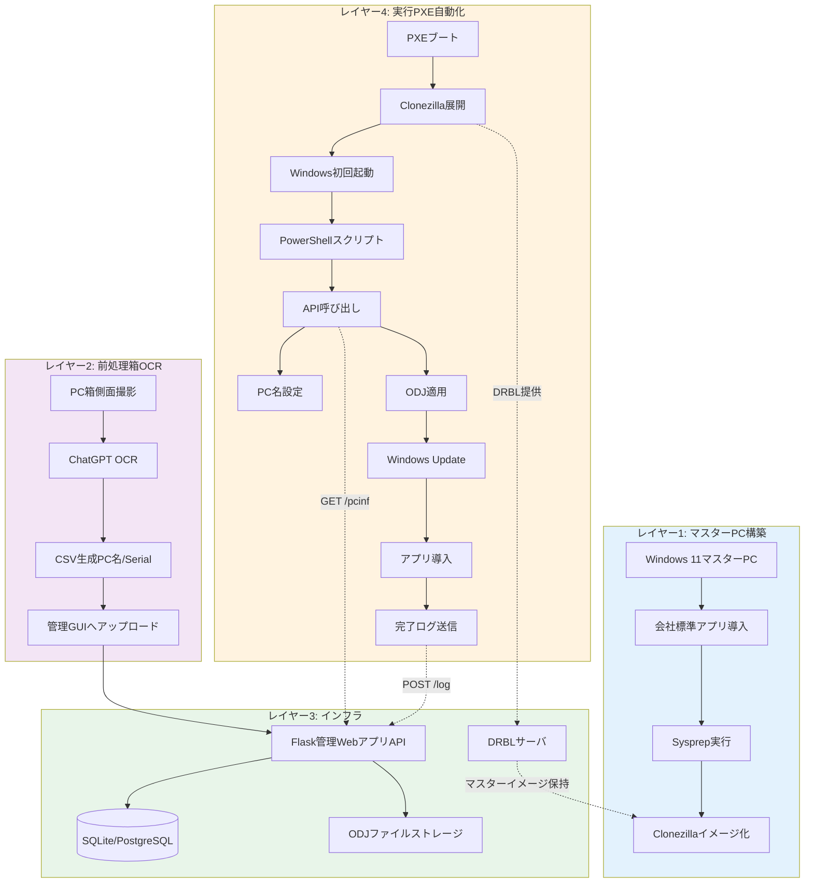
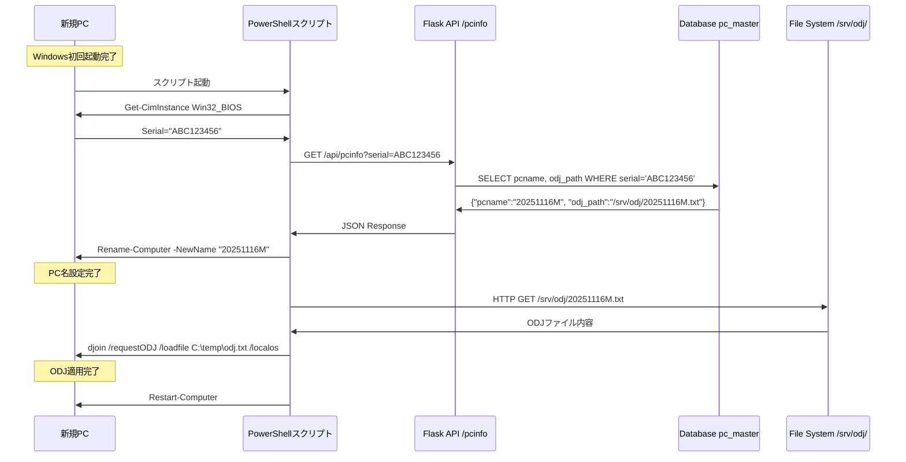
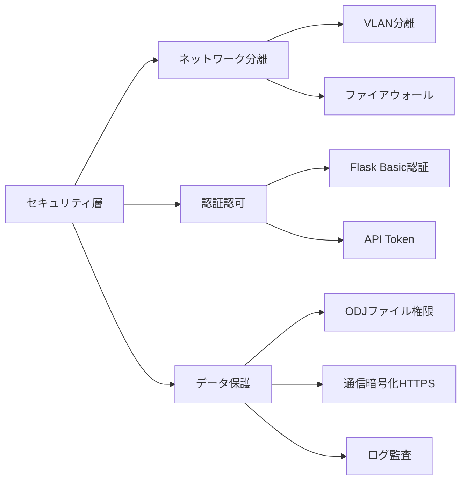

# システム構成図

## 概要

会社キッティング自動化フレームワークの全体システム構成を示します。本システムは4レイヤー構造で設計され、「LANに挿して電源を入れるだけ」で100台規模のPCを完全自動キッティングします。

## 目次

1. [4レイヤーアーキテクチャ図](#4レイヤーアーキテクチャ図)
2. [コンポーネント配置図](#コンポーネント配置図)
3. [ネットワークトポロジー図](#ネットワークトポロジー図)
4. [データフロー図](#データフロー図)

---

## 4レイヤーアーキテクチャ図



---

## コンポーネント配置図

```
┌─────────────────────────────────────────────────────────────────────────┐
│                        社内ネットワーク (LAN)                            │
│                         192.168.1.0/24 (例)                             │
└─────────────────────────────────────────────────────────────────────────┘
                                    │
        ┌───────────────────────────┼───────────────────────────┐
        │                           │                           │
        │                           │                           │
┌───────▼────────┐       ┌──────────▼──────────┐      ┌────────▼─────────┐
│ 管理PC/作業PC  │       │  DRBLサーバ         │      │ ADドメイン       │
│ (管理者利用)   │       │  (Ubuntu 22.04)     │      │ コントローラ     │
│                │       │                     │      │                  │
│ - ブラウザ     │       │ コンポーネント:     │      │ - djoin /provision│
│ - ChatGPT OCR  │◄─────►│ ┌─────────────────┐│      │ - ODJファイル生成 │
│ - CSV作成      │  HTTP │ │ Flask WebアプリAPI││     │ - OU管理         │
│                │       │ │ (port 5000)     ││      │                  │
└────────────────┘       │ │                 ││      └──────────────────┘
                         │ │ - /api/pcinfo   ││
                         │ │ - /api/log      ││
                         │ └────────┬────────┘│
                         │          │         │
                         │   ┌──────▼──────┐  │
                         │   │   SQLite    │  │
                         │   │ pc_master   │  │
                         │   │ setup_logs  │  │
                         │   └─────────────┘  │
                         │                     │
                         │ ┌─────────────────┐│
                         │ │ DRBL/Clonezilla ││
                         │ │ - DHCP/TFTP     ││
                         │ │ - PXEサーバ     ││
                         │ └─────────────────┘│
                         │                     │
                         │ ストレージ:         │
                         │ /home/partimag/    │
                         │   └─MASTER_2025_v1 │
                         │ /srv/odj/          │
                         │   ├─20251116M.txt  │
                         │   └─20251117M.txt  │
                         └─────────────────────┘
                                    │
                                    │ PXEブート
                                    │ (DHCP, TFTP)
        ┌───────────────────────────┼───────────────────────────┐
        │                           │                           │
┌───────▼────────┐       ┌──────────▼──────────┐      ┌────────▼─────────┐
│ 新規PC #1      │       │  新規PC #2          │      │ 新規PC #N        │
│ Serial: ABC123 │       │  Serial: DEF456     │      │ Serial: XYZ999   │
│ PC名: 未設定   │       │  PC名: 未設定       │      │ PC名: 未設定     │
│                │       │                     │      │                  │
│ 1. PXEブート   │       │ 1. PXEブート        │      │ 1. PXEブート     │
│ 2. イメージ展開│       │ 2. イメージ展開     │      │ 2. イメージ展開  │
│ 3. 自動セットアップ    │ 3. 自動セットアップ │      │ 3. 自動セットアップ│
└────────────────┘       └─────────────────────┘      └──────────────────┘
```

---

## ネットワークトポロジー図

```
                          ┌──────────────────────────────┐
                          │   ルーター/L3スイッチ        │
                          │   Default Gateway            │
                          └───────────┬──────────────────┘
                                      │
                    ┌─────────────────┼─────────────────┐
                    │                 │                 │
            ┌───────▼──────┐  ┌───────▼──────┐  ┌──────▼───────┐
            │ VLAN 100      │  │ VLAN 200     │  │ VLAN 300     │
            │ 管理セグメント │  │ キッティング  │  │ 本番AD       │
            │               │  │ セグメント   │  │ セグメント   │
            └───┬───────────┘  └───┬──────────┘  └──┬───────────┘
                │                  │                 │
        ┌───────▼────────┐ ┌───────▼───────────┐ ┌──▼───────────┐
        │ 管理PC         │ │ DRBLサーバ        │ │ ADサーバ      │
        │ 192.168.1.10   │ │ 192.168.2.1       │ │ 192.168.3.10  │
        │                │ │ (DHCP範囲:        │ │              │
        │ - Flask GUI管理│ │  192.168.2.100-200│ │ - djoin生成  │
        └────────────────┘ │                   │ └──────────────┘
                           │ - PXEサーバ       │
                           │ - APIサーバ       │
                           └───┬───────────────┘
                               │
                ┌──────────────┼──────────────┐
                │              │              │
        ┌───────▼────┐ ┌───────▼────┐ ┌──────▼─────┐
        │新規PC #1   │ │新規PC #2   │ │新規PC #N   │
        │192.168.2.100│ │192.168.2.101│ │192.168.2.150│
        │(DHCP割当)  │ │(DHCP割当)  │ │(DHCP割当)  │
        └────────────┘ └────────────┘ └────────────┘

【ポート情報】
- Flask WebアプリAPI: TCP 5000 (HTTP) ※本番はnginx + uWSGI推奨
- DHCP: UDP 67/68
- TFTP: UDP 69
- HTTP (Clonezilla配信): TCP 80
- AD (LDAP/Kerberos): TCP 389, 636, 88
```

---

## データフロー図

### 全体データフロー

```mermaid
flowchart LR
    subgraph Pre[前処理フェーズ]
        A1[PC箱撮影]
        A2[ChatGPT OCR]
        A3[Serial抽出]
        A4[PC名生成YYYYMMDDM]
        A5[CSV作成]

        A1 --> A2
        A2 --> A3
        A3 --> A4
        A4 --> A5
    end

    subgraph Register[登録フェーズ]
        B1[管理GUI CSVインポート]
        B2[pc_masterテーブルINSERT]
        B3[ODJファイル生成]
        B4[ODJパス登録]

        A5 --> B1
        B1 --> B2
        B2 --> B3
        B3 --> B4
    end

    subgraph Deploy[展開フェーズ]
        C1[新規PC起動]
        C2[PXEブート]
        C3[Clonezillaイメージ取得]
        C4[ディスク展開]

        C1 --> C2
        C2 --> C3
        C3 --> C4
    end

    subgraph Auto[自動セットアップフェーズ]
        D1[Windows初回起動]
        D2[Serial取得]
        D3[API /pcinfo呼出]
        D4[PC名/ODJパス取得]
        D5[PC名設定]
        D6[ODJファイル取得]
        D7[djoin適用]
        D8[再起動]
        D9[Windows Update]
        D10[アプリ導入]
        D11[完了ログ送信]

        C4 --> D1
        D1 --> D2
        D2 --> D3
        D3 --> D4
        D4 --> D5
        D4 --> D6
        D6 --> D7
        D7 --> D8
        D8 --> D9
        D9 --> D10
        D10 --> D11
    end

    subgraph Log[ログ記録フェーズ]
        E1[setup_logsテーブルINSERT]
        E2[完了通知]

        D11 --> E1
        E1 --> E2
    end

    style Pre fill:#f3e5f5
    style Register fill:#e8f5e9
    style Deploy fill:#fff3e0
    style Auto fill:#e3f2fd
    style Log fill:#fce4ec
```



### API通信データフロー詳細



---

## 関連ドキュメント

- [アーキテクチャ図.html](./アーキテクチャ図.html) - HTML版詳細アーキテクチャ図
- [シーケンス図集.md](./シーケンス図集.md) - 各種シーケンス図
- [コンポーネント図.md](./コンポーネント図.md) - レイヤー別コンポーネント詳細
- [BPMNフロー図.html](./BPMNフロー図.html) - 業務プロセスフロー

---

## アーキテクチャ設計原則

### 非機能要件との対応

| 要件項目 | 目標値 | アーキテクチャ対応 |
|---------|--------|-------------------|
| Sysprep成功率 | 100% | マスターPC構築レイヤーでAppX除外処理を実装 |
| API応答時間 | 200ms以下 | SQLiteインデックス最適化、LAN内通信 |
| 同時展開台数 | 10〜20台 | DRBLマルチキャスト、ネットワーク帯域設計 |
| 展開時間 | 60〜90分 | Clonezilla圧縮形式最適化(zstd)、並列処理 |
| 展開失敗率 | 1%未満 | エラーハンドリング、リトライ機構、ログ記録 |
| OCR精度 | 99%以上 | ChatGPT Vision API、手動確認UI |

### セキュリティ設計



---

**作成日**: 2025-11-17
**バージョン**: 1.0
**作成者**: System Architecture Designer
