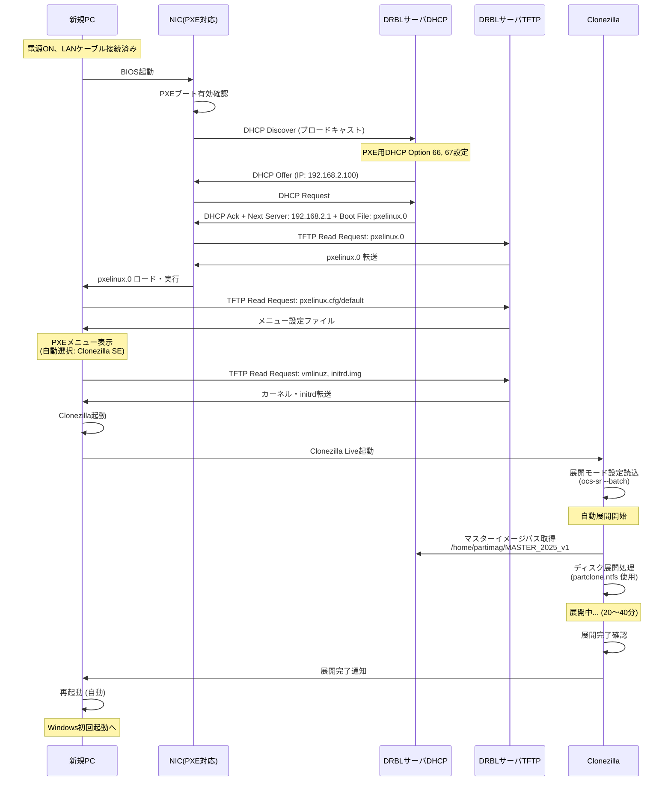
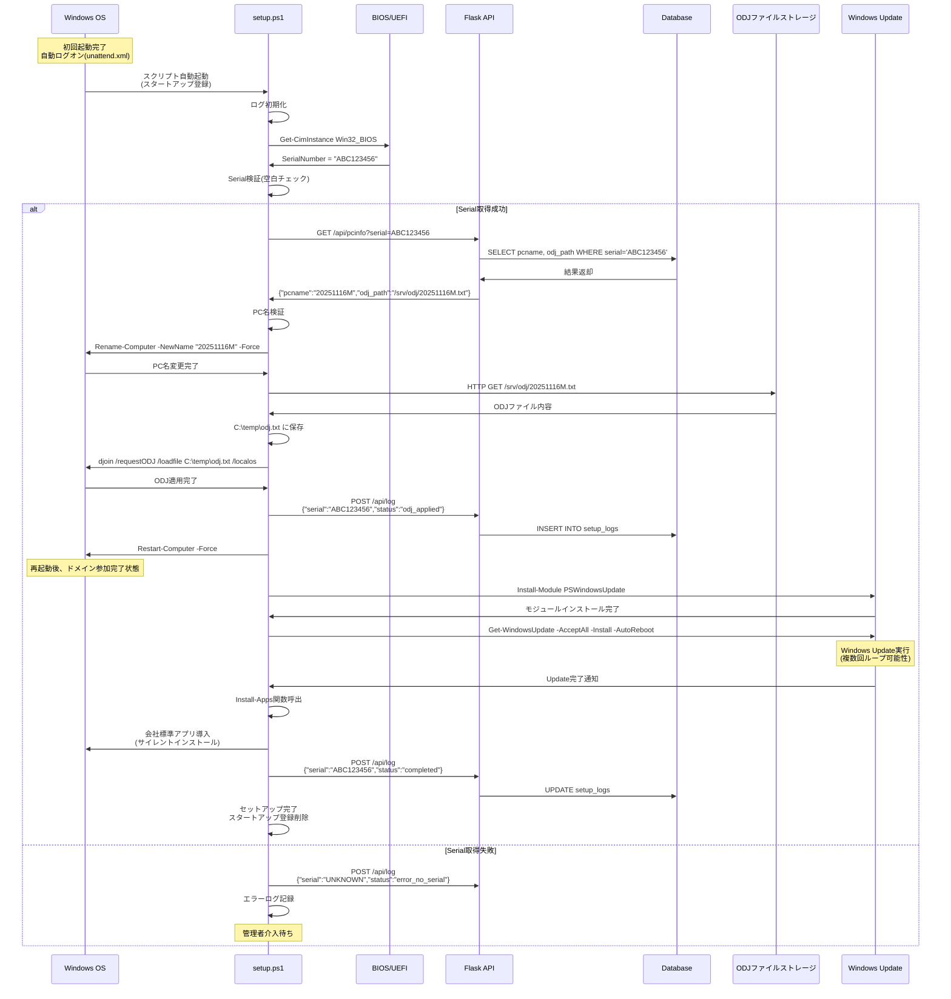
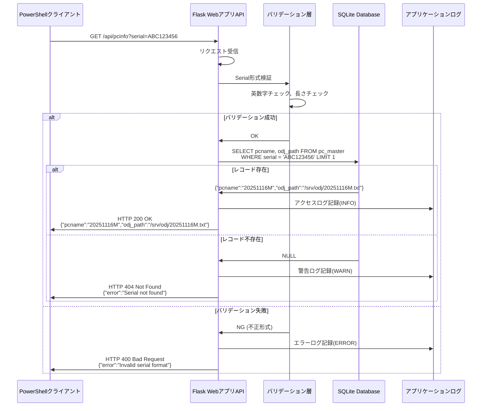
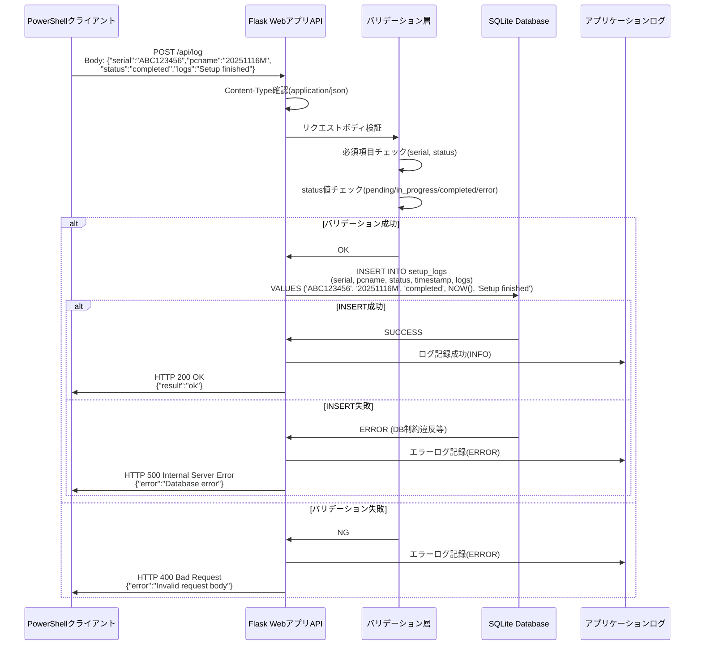
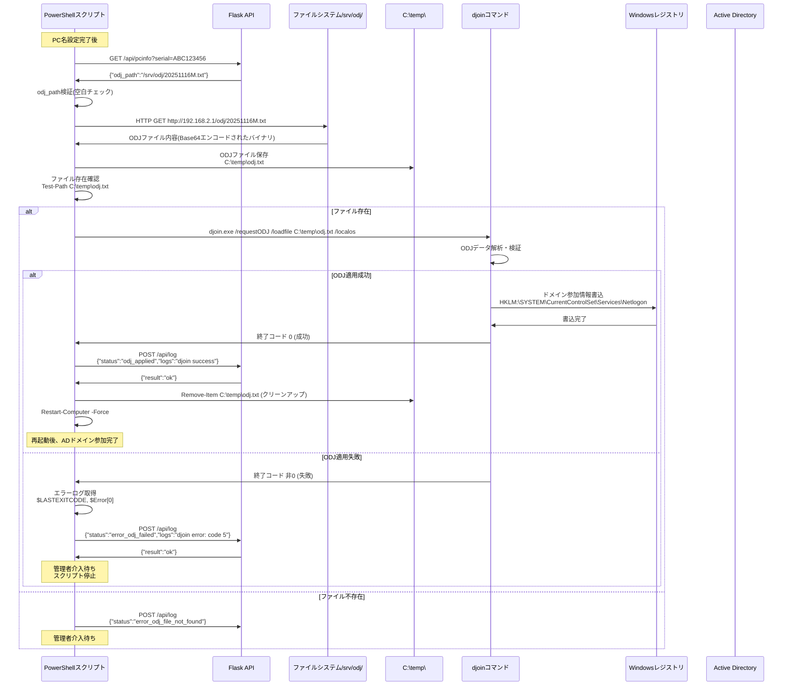
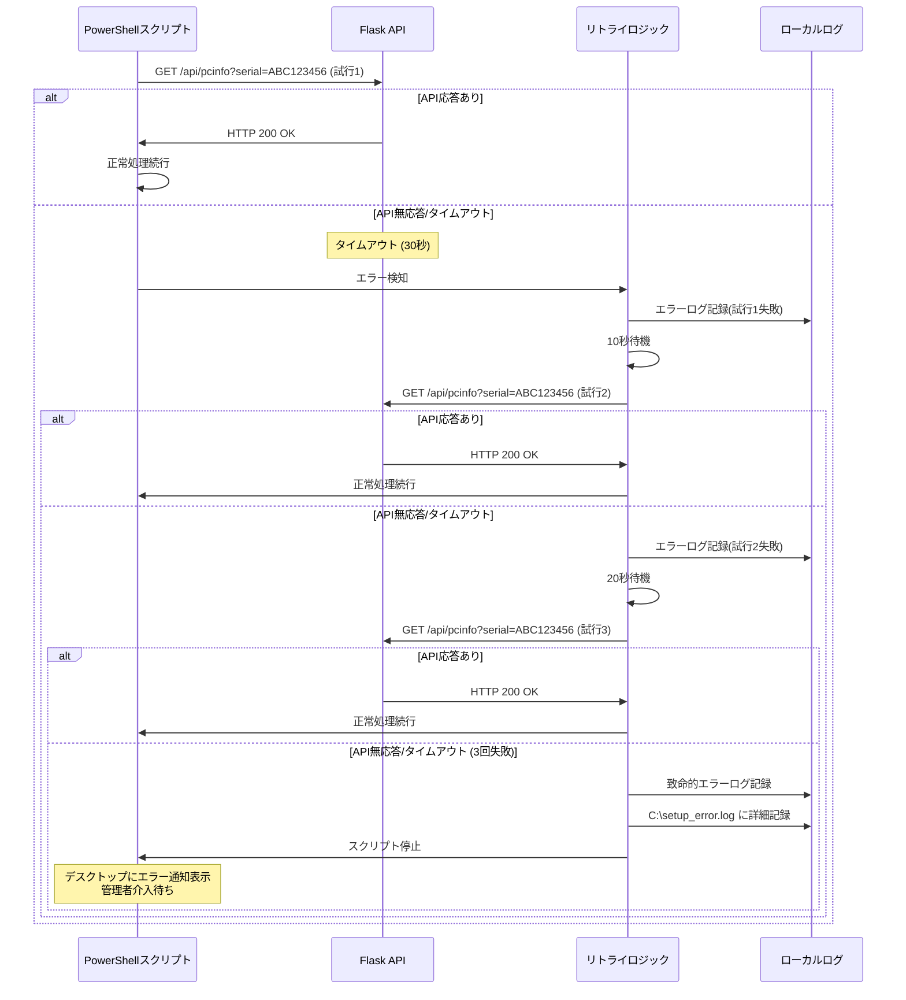
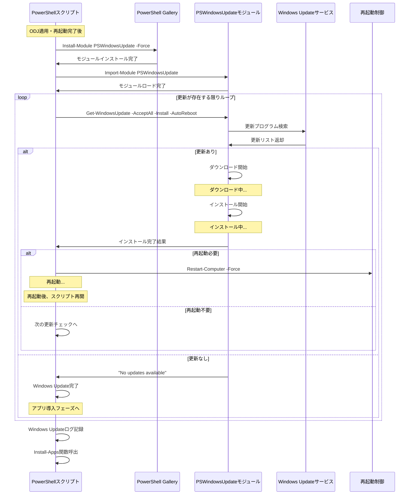

# シーケンス図集

## 概要

会社キッティング自動化フレームワークにおける主要なプロセスフローをシーケンス図で示します。

## 目次

1. [PXEブート〜Clonezilla展開シーケンス](#pxeブートclonezilla展開シーケンス)
2. [PowerShell自動セットアップシーケンス](#powershell自動セットアップシーケンス)
3. [API呼び出しシーケンス詳細](#api呼び出しシーケンス詳細)
4. [ODJ適用シーケンス](#odj適用シーケンス)
5. [エラーハンドリングシーケンス](#エラーハンドリングシーケンス)
6. [Windows Update自動実行シーケンス](#windows-update自動実行シーケンス)

---

## PXEブート〜Clonezilla展開シーケンス



**所要時間**: 約20〜40分（ネットワーク速度、ディスク容量依存）

---

## PowerShell自動セットアップシーケンス



**所要時間**: 約40〜60分（Windows Update内容依存）

---

## API呼び出しシーケンス詳細

### GET /api/pcinfo



### POST /api/log



---

## ODJ適用シーケンス



**djoinコマンド詳細**:
```powershell
djoin.exe /requestODJ /loadfile <ODJファイルパス> /localos
```

**主要終了コード**:
- `0`: 成功
- `5`: アクセス拒否（要管理者権限）
- `87`: パラメータ不正
- その他: システムエラー

---

## エラーハンドリングシーケンス

### API不応答時のリトライ処理



**リトライ設定**:
- 最大リトライ回数: 3回
- 待機時間: 1回目10秒、2回目20秒
- タイムアウト: 30秒/回

---

## Windows Update自動実行シーケンス



**注意事項**:
- 複数回の再起動が発生する可能性
- スクリプトはスタートアップ登録により再起動後も継続実行
- タイムアウト: 1回のUpdate処理は最大120分

---

## 関連ドキュメント

- [システム構成図.md](./システム構成図.md) - 全体アーキテクチャ
- [業務フロー図.md](./業務フロー図.md) - 業務プロセス詳細
- [シーケンス図_PXE_ODJ.html](./シーケンス図_PXE_ODJ.html) - HTML版シーケンス図
- [コンポーネント図.md](./コンポーネント図.md) - 各レイヤーコンポーネント詳細

---

## シーケンス図凡例

| 記号 | 意味 |
|------|------|
| `→` | 同期呼び出し（応答待ち） |
| `--→` | 非同期呼び出し（応答待たない） |
| `Note` | 処理の補足説明 |
| `alt` | 条件分岐 |
| `loop` | 繰り返し処理 |

---

**作成日**: 2025-11-17
**バージョン**: 1.0
**作成者**: System Architecture Designer
