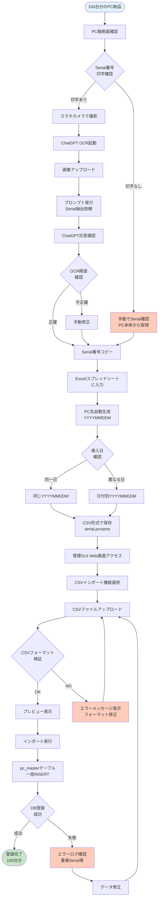
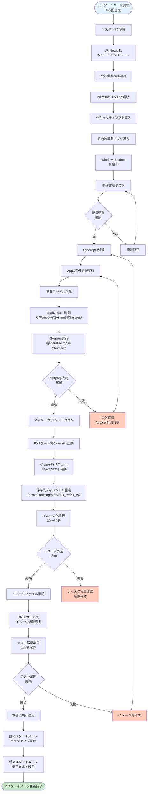
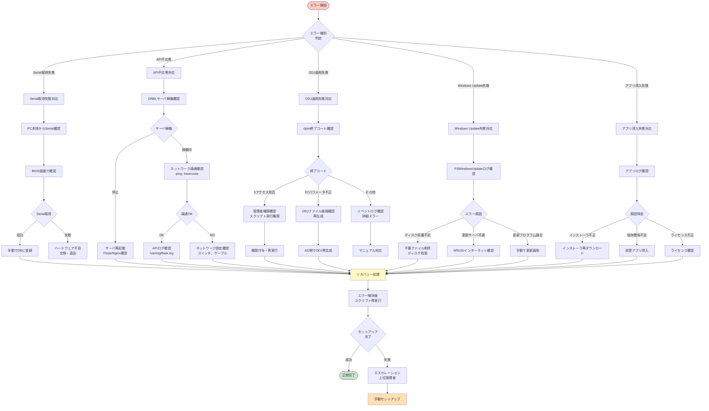
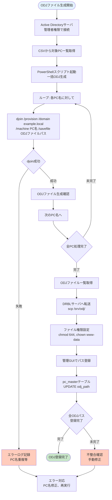
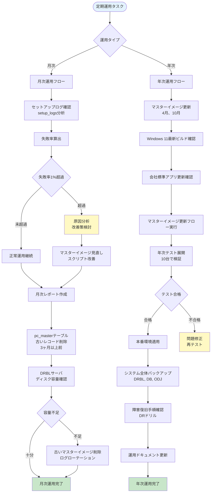

# 業務フロー図

## 概要

会社キッティング自動化フレームワークにおける業務プロセスフローを示します。導入準備からPC展開完了まで、および運用保守フローを網羅します。

## 目次

1. [箱OCR〜CSV登録フロー](#箱ocrcsv登録フロー)
2. [PC展開業務フロー](#pc展開業務フロー)
3. [マスターイメージ更新フロー](#マスターイメージ更新フロー)
4. [エラー発生時の対応フロー](#エラー発生時の対応フロー)
5. [ODJファイル生成・登録フロー](#odjファイル生成登録フロー)
6. [月次・年次運用フロー](#月次年次運用フロー)

---

## 箱OCR〜CSV登録フロー



**想定所要時間**: 100台分で約2〜3時間（OCR + 手動確認含む）

**CSVフォーマット例**:
```csv
serial,pcname
ABC123456,20251116M
DEF789012,20251116M
GHI345678,20251117M
```

---

## PC展開業務フロー

```mermaid
flowchart TD
    Start([PC展開開始]) --> A1[新規PCをキッティング<br/>ネットワークに接続]
    A1 --> A2[LANケーブル接続]
    A2 --> A3[電源投入]

    A3 --> B1[BIOS/UEFI起動]
    B1 --> B2{Boot順序<br/>確認}

    B2 -->|PXE最優先| B3[PXEブート開始]
    B2 -->|PXE無効| B4[BIOS設定変更<br/>PXE有効化]
    B4 --> B3

    B3 --> C1[DHCPサーバから<br/>IPアドレス取得]
    C1 --> C2[TFTPサーバから<br/>pxelinux.0取得]
    C2 --> C3[Clonezillaメニュー表示]

    C3 --> C4{自動展開<br/>設定確認}
    C4 -->|自動| C5[自動展開開始<br/>ユーザー操作不要]
    C4 -->|手動| C6[メニューから<br/>マスターイメージ選択]

    C5 --> D1[マスターイメージ<br/>ダウンロード開始]
    C6 --> D1

    D1 --> D2[ディスク展開処理<br/>20〜40分]
    D2 --> D3{展開成功<br/>確認}

    D3 -->|成功| D4[自動再起動]
    D3 -->|失敗| Error1[エラーログ確認<br/>ディスク不良等]

    D4 --> E1[Windows初回起動]
    E1 --> E2[unattend.xml適用<br/>自動ログオン]
    E2 --> E3[PowerShellスクリプト<br/>自動起動]

    E3 --> F1[Serial番号取得]
    F1 --> F2[API /pcinfo 呼出]
    F2 --> F3{PC名・ODJパス<br/>取得成功}

    F3 -->|成功| F4[PC名設定]
    F3 -->|失敗| Error2[API不応答<br/>リトライ3回]

    F4 --> F5[ODJファイル取得]
    F5 --> F6[djoin適用]
    F6 --> F7{ODJ適用<br/>成功}

    F7 -->|成功| F8[再起動]
    F7 -->|失敗| Error3[ODJ適用失敗<br/>ログ送信]

    F8 --> G1[ドメイン参加完了]
    G1 --> G2[Windows Update実行]
    G2 --> G3{更新あり}

    G3 -->|あり| G4[ダウンロード・インストール]
    G3 -->|なし| H1[アプリ導入開始]

    G4 --> G5{再起動必要}
    G5 -->|必要| G6[再起動]
    G5 -->|不要| G2

    G6 --> G2

    H1 --> H2[Microsoft 365 Apps<br/>サイレントインストール]
    H2 --> H3[セキュリティソフト<br/>インストール]
    H3 --> H4[その他会社標準アプリ<br/>インストール]

    H4 --> I1[完了ログAPI送信<br/>POST /api/log]
    I1 --> I2[スタートアップ登録削除]
    I2 --> End1([セットアップ完了<br/>ユーザー引渡可能])

    Error1 --> ErrorHandle1[エラー対応フロー]
    Error2 --> ErrorHandle1
    Error3 --> ErrorHandle1

    style Start fill:#e3f2fd
    style End1 fill:#c8e6c9
    style Error1 fill:#ffccbc
    style Error2 fill:#ffccbc
    style Error3 fill:#ffccbc
    style ErrorHandle1 fill:#fff9c4
```



**所要時間**: 1台あたり60〜90分（ネットワーク環境、Windows Update内容に依存）

**同時展開**: 10〜20台並行可能（DRBL性能による）

---

## マスターイメージ更新フロー



**更新頻度**: 年2回（4月、10月推奨）

**所要時間**: 1回あたり4〜6時間（テスト含む）

---

## エラー発生時の対応フロー



**エスカレーション基準**:
- 自動リトライ3回失敗
- ハードウェア不良の疑い
- システムエラー（原因不明）

---

## ODJファイル生成・登録フロー



**djoinコマンド例**:
```powershell
djoin /provision `
  /domain example.local `
  /machine 20251116M `
  /savefile \\DRBL-Server\odj\20251116M.txt `
  /machineou "OU=Kitting,DC=example,DC=local"
```

---

## 月次・年次運用フロー



**月次タスク所要時間**: 2〜4時間

**年次タスク所要時間**: 1〜2日（テスト期間含む）

---

## 関連ドキュメント

- [システム構成図.md](./システム構成図.md) - アーキテクチャ全体像
- [シーケンス図集.md](./シーケンス図集.md) - 詳細シーケンス図
- [BPMNフロー図.html](./BPMNフロー図.html) - HTML版BPMNフロー
- [コンポーネント図.md](./コンポーネント図.md) - レイヤー別コンポーネント

---

## 業務フロー設計原則

### 自動化優先度

| 優先度 | 業務プロセス | 自動化率 |
|-------|------------|---------|
| 高 | PXE〜Windows初回起動 | 100% |
| 高 | ODJ適用・ドメイン参加 | 100% |
| 高 | Windows Update | 100% |
| 中 | アプリ導入 | 90%（一部手動確認） |
| 低 | 箱OCR〜CSV作成 | 70%（OCR精度99%） |
| 低 | マスターイメージ更新 | 50%（手動介入必要） |

### エラー対応SLA

| エラー種別 | 対応時間 | エスカレーション条件 |
|-----------|---------|-------------------|
| API不応答 | 10分以内 | 3回リトライ失敗 |
| Serial取得失敗 | 30分以内 | ハードウェア不良疑い |
| ODJ適用失敗 | 1時間以内 | AD側エラー |
| 展開失敗 | 1時間以内 | Clonezillaエラー |

---

**作成日**: 2025-11-17
**バージョン**: 1.0
**作成者**: System Architecture Designer
